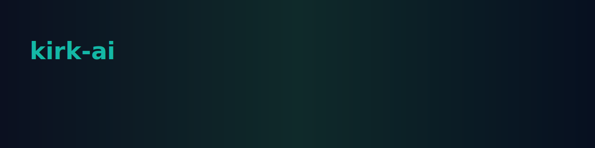

# kirk-ai



**kirk-ai** is a compact command-line interface crafted to interact with Ollama AI models. This site provides guided documentation to get you started quickly, explain the architecture, and help you integrate `kirk-ai` into your workflows.


## Quick links

- Installation
- Usage
- Commands
- Architecture
- Contributing

---

## Why kirk-ai?

- Minimal, focused CLI for model interactions
- Clear separation between API client, templates and commands
- Lightweight and easily extensible


### Example — quick chat

```bash
./kirk-ai chat "Hello — what's new?"
```

This repository is designed for contributors and users alike. Use the sidebar to navigate deeper sections or search from the top bar.
